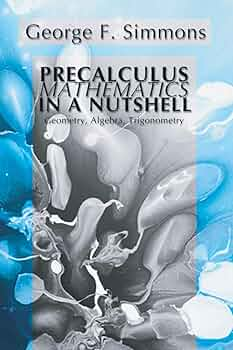

### Overview 
- this project collects all my math learning path and includes long theory notes + C++ project & handwritten IPad notes. Its going to be a growing project over my university & job journey. 

#### Used Materials

> Screenshots from topic XY 

### Ressources
- [ScratchAPixel](https://wiki.libsdl.org/SDL2/FrontPage)
- [Precalculus - Simmons](https://www.amazon.de/-/en/Precalculus-Mathematics-Nutshell-Geometry-Trigonometry/dp/1592441300)
